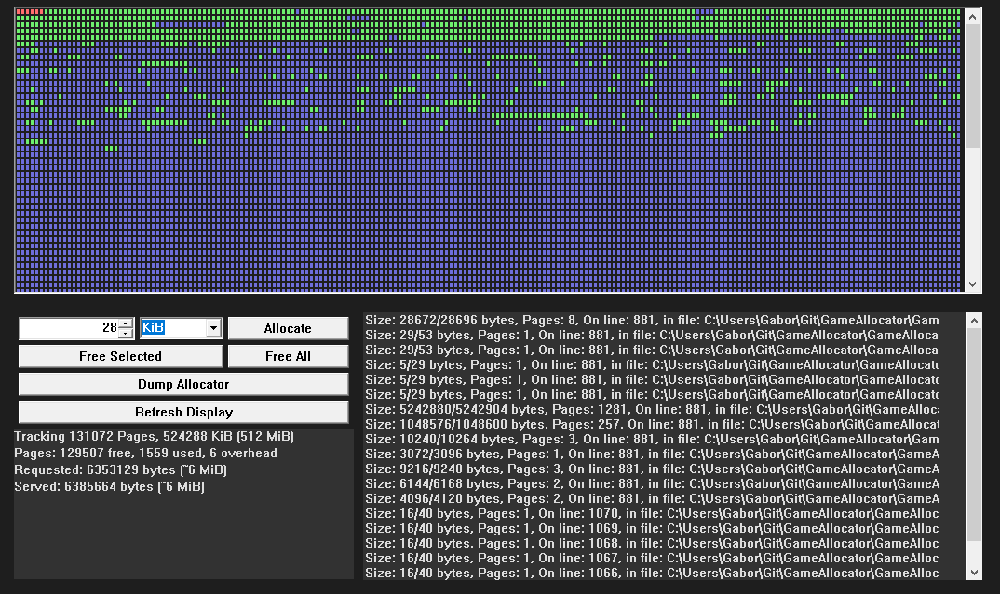

# Game Allocator

Game Allocator is a generic memory manager intended for games, embedded devices, and web assembly. Given a large array of memory, the library provides functions to allocate and release that memory similar to malloc / free.

The memory will be broken up into pages (4 KiB by default) and tracked at the page granularity. 
A sub-allocator provided which breaks the page up into a fast free list for smaller allocation.

Implementations and ```#defines``` for ```malloc```, ```new```, ```new[]```, ```free```, ```delete```, and ```delete[]``` are optionally provided. An optional STL allocator is also optionally provided.

All of the code is in [mem.h](mem.h) and [mem.cpp](mem.cpp). The [Win32Sample/Win32.cpp](Win32Sample/Win32.cpp) file isn't production ready, it's a hacky font-end to the memory manager. The same data that it displays is available trough the ```Memory::Debug``` namespace.



## Usage

Let's assume you have a ```void*``` to some large area of memory and know how many bytes large that area is.  Call the ```Memory::Initialize``` function. The first two arguments are the memory and size, the third argument is the page size with which the memory should be managed. The default page size is 4 KiB. The pointer being passed to ```Memory::Initialize``` should be 8 byte aligned, and the size of the memory should be a multiple of the ```pageSize``` argument.

The ```Memory::AlignAndTrim``` helper function will align a region of memory so it's ready for initialize. This function modifies the ```memory``` and ```size``` variables that are passed to the function. ```Memory::AlignAndTrim``` returns the number of bytes lost.

> After creating an allocator, set the ```Memory::GlobalAllocator``` pointer to the object returned by ```Memory::Initialize```.  If an allocator isn't specified (like the default ```new``` operator, or ```malloc``` functions) the ```Memory::GlobalAllocator``` object will be used instead.

You can allocate memory with the ```Memory::Allocate``` function, and release memory with the ```Memory::Release``` function. These functions require the same arguments as ```malloc``` & ```free```,
	and they also have optional arguments. ```Allocate``` takes an optional ```alignment```, which by default is 0. Un-aligned allocation are prefered, they will be 4 or 8 byte aligned, and can utilize a fast free list allocator. Both the ```Allocate``` and ```Release``` functions take an optional ```Allocator*```, this allows the system to support multiple allocators. Both functions also take an optional ```const char*``` which is the location of the allocation.

When you are finished with an allocator, clean it up by calling ```Memory::Shutdown```. The shutdown function will assert in debug builds if there are any memory leaks.

# Example

```
void run() {
    // Declare how much memory to use
    unsigned int size = MB(512);

    // Allocate memory from the operating system
    LPVOID memory = VirtualAlloc(0, size, MEM_RESERVE | MEM_COMMIT, PAGE_READWRITE); // Windows

    // Initialize the global allocator
    u32 lost = Memory::AlignAndTrim(&m, &size, Memory::DefaultPageSize);
    Memory::GlobalAllocator = Memory::Initialize(m, size, Memory::DefaultPageSize);

    // Allocate & release memory
    int* number = Memory::Allocate(sizeof(int)); // Only the number of bytes is required
    Memory::Release(number); // Only the void* is required

    // Cleanup the global allocator
    Memory::Shutdown(Memory::GlobalAllocator);
    Memory::GlobalAllocator = 0;

    // Release memory back to operating system
    VirtualFree(memory, 0, MEM_RELEASE);
}
```

# Compile flags

* ```MEM_FIRST_FIT```: This affects how fast memory is allocated. If it's set then every allocation searches for the first available page from the start of the memory. If it's not set, then an allocation header is maintained. It's advanced with each allocation, and new allocations search for memory from the allocation header.
* ```MEM_CLEAR_ON_ALLOC```: When set, memory will be cleared to 0 before being returned from ```Memory::Allocate```: If both clear and debug on alloc are set, clear will take precedence
* ```MEM_DEBUG_ON_ALLOC```: If set, full page allocations will fill the padding of the page with "```-MEMORY```"
* ```MEM_IMPLEMENT_MALLOC```: Provide function declarations and implementations for: ```malloc```, ```free```, ```memset```, and ```memcpy```. These methods can not track allocation location.
* ```MEM_DEFINE_MALLOC```: If set, ```malloc``` will be declared as a ```#define``` for ```Memory::Allocate```: and similarly free will be declared as a ```#define``` for ```Memory::Release```
* ```MEM_IMPLEMENT_NEW```: Provide function declarations and implementations for ```new``` & ```delete```
* ```MEM_DEFINE_NEW```: If set, new will be declared as a ```#define``` for ```Memory::Allocate```, and similarly delete will be declared as a #define for ```Memory::Release```
* ```MEM_IMPLEMENT_STL```: If set, ```Memory::STLAllocator<T>``` is defined. It can be used for STL allocators like so: ```std::vector<int, Memory::STLAllocator<int>> numbers;```
* ```MEM_USE_SUBALLOCATORS```: If set, small allocations will be made using a free list allocaotr. There are free list allocators for 64, 128, 256, 512, 1024 and 2049 byte allocations. Only allocations that don't specify an alignment can use the fast free list allocator. The sub-allocator will provide better page utilization, for example a 4096 KiB page can hold 32 128 bit allocations.
* ```MEM_TRACK_LOCATION```: If set, a ```const char*``` will be added to ```Memory::Allocation``` which tracks the ```__LINE__``` and ```__FILE__``` of each allocation. Setting this bit will add 8 bytes to the ```Memory::Allocation``` struct.

# Debugging

There are a few debug functions exposed in the ```Memory::Debug``` namespace. When an allocator is initialized, the page immediateley before the first allocatable page is reserved as a debug page. You can fill this page with whatever  data is needed. Any function in ```Memory::Debug``` might overwrite the contents of the debug page. You can get a pointer to the debug page of an allocator with the ```Memory::Debug::DevPage``` function.

The ```Memory::Debug::MemInfo``` function can be used to retrieve information about the state of the memory allocator. It provides meta data like how many pages are in use, a list of active allocations, and a visual bitmap chart to make debugging the memory bitmask easy. You can write this information to a file like so:

```
DeleteFile(L"MemInfo.txt");
HANDLE hFile = CreateFile(L"MemInfo.txt", GENERIC_WRITE, FILE_SHARE_READ, NULL, CREATE_NEW, FILE_ATTRIBUTE_NORMAL, NULL);
Memory::Debug::MemInfo(Memory::GlobalAllocator, [](const u8* mem, u32 size, void* fileHandle) {
    HANDLE file = *(HANDLE*)fileHandle;
    DWORD bytesWritten;
    WriteFile(file, mem, size, &bytesWritten, nullptr);
}, &hFile);
CloseHandle(hFile);
```

There is a similar ```Memory::Debug::PageContent```, which given a page number will dump the binary conent of a page. The outputof the above log will look something like this:

```
Tracking 256 pages, Page size: 4096 bytes
Total memory size: 1024 KiB (1 MiB)
Page state: 231 free, 23 used, 2 overhead
Requested: 60656 bytes, Served: 94208 bytes

Active allocations:
	114688, size: 4096, padded: 4120, alignment: 0, first page: 28, 
        prev: 86016, next: 110592, location: On line: 881, in file: 
        C:\Users\Gabor\Git\GameAllocator\GameAllocator\WinMain.cpp
	12160, size: 64, padded: 88, alignment: 0, first page: 2, 
        prev: 16320, next: 0, location: On line: 1064, in file: 
        C:\Users\Gabor\Git\GameAllocator\GameAllocator\WinMain.cpp
    [Rest of active list removed for brevity]

Page chart:
	000000-0000000-0-00-0000-00000--------------------------------------------------
	--------------------------------------------------------------------------------
	--------------------------------------------------------------------------------
	----------------
```

# Resources

* [Compile without CRT](https://yal.cc/cpp-a-very-tiny-dll/) 
* Ready Set Allocate: [Part 1](https://web.archive.org/web/20120419125628/http://www.altdevblogaday.com/2011/04/11/ready-set-allocate-part-1/), [Part 2](https://web.archive.org/web/20120419125404/http://www.altdevblogaday.com/2011/04/26/ready-set-allocate-part-2/), [Part 3](https://web.archive.org/web/20120419010208/http://www.altdevblogaday.com/2011/05/15/ready-set-allocate-part-3/), [Part 4](https://web.archive.org/web/20120418212016/http://www.altdevblogaday.com/2011/05/26/ready-set-allocate-part-4/), [Part 5](https://web.archive.org/web/20120413201435/http://www.altdevblogaday.com/2011/06/08/ready-set-allocate-part-5/), [Part 6](https://web.archive.org/web/20120321205231/http://www.altdevblogaday.com/2011/06/30/ready-set-allocate-part-6/)
* [Concatenate \_\_LINE\_\_ and \_\_FILE\_\_](https://stackoverflow.com/questions/2653214/stringification-of-a-macro-value)
* C++ overload [new](https://cplusplus.com/reference/new/operator%20new/), [new[]](https://cplusplus.com/reference/new/operator%20new[]/), [delete](https://cplusplus.com/reference/new/operator%20delete/), and [delete[]](https://cplusplus.com/reference/new/operator%20delete[]/)
* [Stack overflow memory alignment discussion](https://stackoverflow.com/questions/227897/how-to-allocate-aligned-memory-only-using-the-standard-library)
* [Scott Schurr's const string](https://www.youtube.com/watch?v=BUnNA2dLRsU)